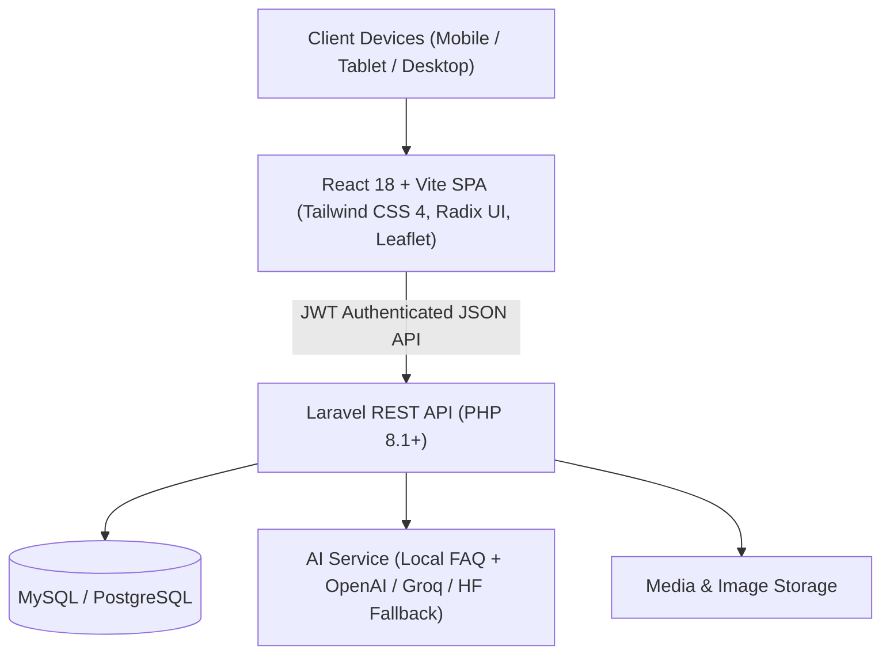

# 🌴 Discover Mansalay — Mobile-Responsive Tourism Web Platform

[](https://reactjs.org/)
[](https://vitejs.dev/)
[](https://www.typescriptlang.org/)
[](https://tailwindcss.com/)
[](https://laravel.com/)
[](https://leafletjs.com/)
[](LICENSE)

> A modern, mobile-first web platform designed to promote ecotourism, cultural heritage, local enterprises, and accommodations in the Municipality of **Mansalay, Oriental Mindoro, Philippines**.

---

## 📖 Table of Contents

- [Overview](#-overview)
- [Key Features by Role](#-key-features-by-role)
- [System Architecture & Tech Stack](#-system-architecture--tech-stack)
- [Repository Structure](#-repository-structure)
- [Prerequisites](#-prerequisites)
- [Getting Started & Local Setup](#-getting-started--local-setup)
  - [1. Backend Setup (Laravel API)](#1-backend-setup-laravel-api)
  - [2. Frontend Setup (React + Vite)](#2-frontend-setup-react--vite)
- [Environment Configuration](#-environment-configuration)
- [API Documentation Overview](#-api-documentation-overview)
- [AI Chatbot Engine](#-ai-chatbot-engine)
- [Testing & Quality Assurance](#-testing--quality-assurance)
- [Deployment](#-deployment)
- [Contributing & License](#-contributing--license)

---

## 🌟 Overview

**Discover Mansalay** bridges the gap between travelers, local businesses, and municipal tourism officers. It empowers tourists to discover hidden gems, navigate through interactive GIS maps, curate personalized travel itineraries, and interact with an AI tourism assistant—while giving local resort owners, artisans, and enterprises a digital storefront to showcase their services and crafts.

---

## 👥 Key Features by Role

### 🧭 1. Tourists & Visitors
- **Interactive Tourism Map:** Leaflet-powered GIS mapping displaying geo-tagged resorts, landmarks, beaches, cultural sites, and emergency hubs.
- **Attractions & Cultural Discovery:** High-resolution directories of Mansalay's natural attractions, heritage spots, and events calendar.
- **Accommodations & Resort Showcase:** Explore rooms, amenities, pricing, contact details, and location guides.
- **Local Products & Crafts:** Digital catalog highlighting Mansalay delicacies, indigenous Mangyan crafts, and agro-tourism goods.
- **Custom Itinerary Planner & Wishlist:** Build day-by-day travel itineraries and bookmark must-visit spots.
- **Smart AI Tourism Assistant:** Context-aware chatbot with local FAQ knowledge and fallback integration to LLMs (OpenAI / Groq / Hugging Face).
- **Reviews & Ratings:** Community-driven feedback system for authenticated visitors.

### 🏨 2. Resort & Accommodation Owners
- **Dedicated Business Portal:** Manage lodging profiles, room types, rates, amenities, and high-quality photo galleries.
- **Inquiry Management:** Receive and manage direct traveler queries and booking requests.
- **Subscription Tiers:** Flexible business verification and featured listing subscription plans.

### 🛍️ 3. Local Enterprises & Artisans
- **Product Catalog Management:** Showcase indigenous products, handcrafted items, and agricultural produce.
- **Business Profile:** Public brand page with direct contact links and business location.
- **Promotions & Spotlights:** Highlight seasonal offerings and local promotions.

### 🛡️ 4. Tourism Administrators & Municipal Officers
- **Content Moderation & Publishing:** Review, approve, and publish official municipal attractions, festivals, and emergency advisories.
- **User & Merchant Management:** Verify resort/enterprise registrations and manage system accounts.
- **Subscription & Payment Verification:** Review and approve merchant subscription payments.
- **Platform Analytics:** Track visitor engagement, popular attractions, and platform growth metrics.

---

## 🛠️ System Architecture & Tech Stack



### 💻 Frontend
- **Framework:** React 18 with TypeScript
- **Bundler & Build Tool:** Vite 6
- **Routing:** React Router v7
- **Styling:** Tailwind CSS v4, Motion (Framer Motion), Radix UI Primitives, Lucide Icons
- **Interactive Maps:** Leaflet & React-Leaflet
- **UI Components:** Sonner (Toast notifications), SweetAlert2, Recharts, Embla Carousel

### ⚙️ Backend
- **Framework:** Laravel 8+ (PHP 8.1+)
- **Authentication:** JWT (JSON Web Tokens) with secure token refresh & role-based middleware
- **Database:** MySQL 8.0+ / PostgreSQL (production ready)
- **AI Integrations:** Hybrid FAQ Matcher + OpenAI GPT-4o-mini / Groq / Hugging Face Inference API

---

## 📁 Repository Structure

```text
Mobileresponsivewebplatform/
├── backend/                        # Laravel REST API Application
│   ├── app/
│   │   ├── Http/Controllers/Api/  # API Controllers (Auth, Listings, Chat, Admin)
│   │   ├── Models/                 # Eloquent Models (User, Attraction, Resort, Product...)
│   │   └── Middleware/             # JWT & Role Access Middleware
│   ├── database/                   # Migrations, Factories & Database Seeders
│   ├── resources/                  # FAQs knowledge base and views
│   ├── routes/api.php              # RESTful API Endpoints
│   ├── Dockerfile                  # Container definition for backend
│   └── composer.json               # PHP Dependencies
│
├── src/                            # React + Vite Frontend
│   ├── app/
│   │   ├── components/             # Reusable UI components & dialogs
│   │   ├── context/                # Authentication & Theme state contexts
│   │   ├── hooks/                  # Custom React hooks
│   │   ├── layouts/                # Root & Navigation layouts
│   │   ├── lib/                    # API client, utilities, and helpers
│   │   ├── pages/                  # Page routes
│   │   │   ├── admin/              # Administrator portal pages
│   │   │   ├── enterprise/         # Local business / artisan pages
│   │   │   ├── resort/             # Resort & accommodation owner pages
│   │   │   └── tourist/            # Visitor exploration & discovery pages
│   │   └── routes.tsx              # Application router definition
│   ├── main.tsx                    # React application entry point
│   └── styles/                     # Global stylesheet & Tailwind configurations
│
├── public/                         # Public assets & static images
├── package.json                    # Frontend dependencies & npm scripts
├── vite.config.ts                  # Vite configuration
└── render.yaml                     # Render.com multi-service deployment spec
```

---

## ⚡ Prerequisites

Before running the project locally, ensure you have the following installed:

- **Node.js**: `v18.x` or higher ([Download Node.js](https://nodejs.org/))
- **PHP**: `8.1` or higher ([Download PHP](https://www.php.net/))
- **Composer**: `v2.x` ([Download Composer](https://getcomposer.org/))
- **Database Server**: MySQL `8.0+` (e.g., via Laragon, XAMPP, or standalone MySQL)
- **Git**: ([Download Git](https://git-scm.com/))

---

## 🚀 Getting Started & Local Setup

### 1. Backend Setup (Laravel API)

1. Open your terminal and navigate to the backend directory:
   ```bash
   cd backend
   ```

2. Install PHP dependencies:
   ```bash
   composer install
   ```

3. Configure your environment file:
   ```bash
   cp .env.example .env
   ```

4. Generate application key and JWT secret:
   ```bash
   php artisan key:generate
   # Generate strong JWT secret key if not automatically configured:
   php artisan tinker --execute="echo base64_encode(random_bytes(32));"
   ```

5. Configure database credentials in `backend/.env`:
   ```env
   DB_CONNECTION=mysql
   DB_HOST=127.0.0.1
   DB_PORT=3306
   DB_DATABASE=discover_mansalay
   DB_USERNAME=root
   DB_PASSWORD=
   ```

6. Run migrations and seed data:
   ```bash
   php artisan migrate --seed
   ```

7. Create symbolic link for uploaded media:
   ```bash
   php artisan storage:link
   ```

8. Start the Laravel development server:
   ```bash
   php artisan serve --port=8000
   ```
   > The API will now be accessible at `http://localhost:8000/api`.

---

### 2. Frontend Setup (React + Vite)

1. Navigate to the root frontend directory:
   ```bash
   cd ..
   ```

2. Install npm dependencies:
   ```bash
   npm install
   ```

3. Set up environment variables in `.env`:
   ```env
   VITE_API_BASE=http://localhost:8000
   VITE_API_URL=http://localhost:8000/api
   ```

4. Start the Vite development server:
   ```bash
   npm run dev
   ```

5. Open your browser and visit: `http://localhost:5173`

---

## 🔐 Environment Configuration

### Frontend Environment (`.env`)

| Variable | Description | Default / Example |
| :--- | :--- | :--- |
| `VITE_API_BASE` | Base backend server URL | `http://localhost:8000` |
| `VITE_API_URL` | Base API endpoint prefix | `http://localhost:8000/api` |

### Backend Key Environment Variables (`backend/.env`)

| Variable | Description | Default / Example |
| :--- | :--- | :--- |
| `APP_ENV` | Environment mode (`local` / `production`) | `local` |
| `APP_KEY` | Laravel encryption key | `base64:...` |
| `FRONTEND_URL` | Allowed CORS origin URL | `http://localhost:5173` |
| `JWT_SECRET` | Secret key used for signing JWTs | `base64:...` |
| `JWT_TTL` | Token expiration in minutes | `1440` (24 hours) |
| `DB_CONNECTION` | Database driver (`mysql` / `pgsql`) | `mysql` |
| `OPENAI_API_KEY` | *(Optional)* OpenAI API key for chatbot fallback | `sk-...` |
| `OPENAI_MODEL` | *(Optional)* OpenAI model name | `gpt-4o-mini` |
| `GROQ_API_KEY` | *(Optional)* Groq Cloud API Key | `gsk_...` |
| `HUGGINGFACE_API_KEY` | *(Optional)* Hugging Face access token | `hf_...` |

---

## 📡 API Documentation Overview

The Laravel backend exposes structured RESTful JSON endpoints:

### 🔑 Authentication (`/api/auth/*`)
- `POST /api/auth/register` — Register new user (Tourist, Resort, Enterprise)
- `POST /api/auth/login` — Authenticate and receive JWT token
- `POST /api/auth/logout` — Invalidate user token
- `POST /api/auth/refresh` — Refresh expired JWT token
- `GET  /api/auth/me` — Fetch current authenticated user profile

### 🌴 Discovery & Public Listings (`/api/*`)
- `GET /api/attractions` — List all published tourist spots and landmarks
- `GET /api/events` — Retrieve upcoming cultural festivals and municipal events
- `GET /api/accommodations` — Browse verified resorts, homestays, and rooms
- `GET /api/products` — Browse local souvenirs, produce, and Mangyan crafts
- `GET /api/business/{type}/{id}` — Get public merchant profile

### 🤖 AI Assistant (`/api/chat/*`)
- `POST /api/chat` — Submit query to AI tourism assistant (Local FAQ + LLM Fallback)

### 💼 Merchant Portals
- `/api/resort/*` — Resort profile, room listings, photos, and inquiries
- `/api/enterprise/*` — Enterprise profile, product showcase, and inquiries

### 🛡️ Admin Moderation (`/api/admin/*`)
- `/api/admin/users` — User management and role assignment
- `/api/admin/content` — Attractions and events publish/edit/delete
- `/api/admin/subscriptions` — Subscription verification and status updates

---

## 🤖 AI Chatbot Engine

Discover Mansalay includes a cost-effective, high-accuracy **hybrid AI engine**:
1. **Tier 1 (Fast & Free):** Local keyword and FAQ knowledge base stored in `backend/resources/faqs.json`.
2. **Tier 2 (AI Fallback):** If local confidence is below threshold, queries gracefully fall back to an integrated LLM provider (OpenAI GPT-4o-mini, Groq Llama, or Hugging Face) using strict prompt constraints to prevent hallucinations about Mansalay tourism.

---

## 🧪 Testing & Quality Assurance

### Frontend Testing (Vitest & Testing Library)
```bash
# Run test suite
npm run test

# Run tests in watch mode
npm run test:watch

# Launch interactive visual test runner UI
npm run test:ui
```

### Backend Testing (PHPUnit)
```bash
cd backend
./vendor/bin/phpunit
```

---

## 🚢 Deployment

### 🐳 Docker Deployment
A ready-to-use multi-stage `Dockerfile` is provided in the `backend/` folder:
```bash
docker build -t discover-mansalay-api ./backend
docker run -p 8000:80 discover-mansalay-api
```

### ☁️ Cloud Platforms
- **Frontend:** Optimized for **Vercel** or **Cloudflare Pages** (`vercel.json` included).
- **Backend:** Configured for **Render.com** or **Fly.io** (`render.yaml` and `Procfile` included).

---

## 👥 Roles & Access Matrix

| Role | Browse Map & Attractions | Bookmarks & Itinerary | Manage Resort Listing | Manage Products | Moderate & Publish | Admin Dashboard |
| :--- | :---: | :---: | :---: | :---: | :---: | :---: |
| **Guest / Visitor** | ✅ | ❌ | ❌ | ❌ | ❌ | ❌ |
| **Tourist** | ✅ | ✅ | ❌ | ❌ | ❌ | ❌ |
| **Resort Owner** | ✅ | ✅ | ✅ | ❌ | ❌ | ❌ |
| **Enterprise** | ✅ | ✅ | ❌ | ✅ | ❌ | ❌ |
| **Administrator** | ✅ | ✅ | ✅ | ✅ | ✅ | ✅ |

---

## 📄 License

This project is licensed under the [MIT License](LICENSE) — see the LICENSE file for details.

---

<p align="center">
  Made with ❤️ for the Municipality of <b>Mansalay, Oriental Mindoro</b>.
</p>