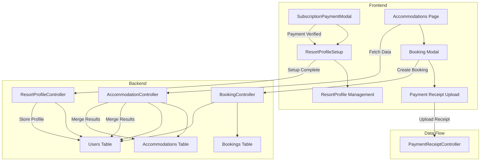

# Design Document: Resort Profile as Accommodation

## Overview

This design transforms the resort owner model from managing individual accommodation listings to making the resort owner's profile itself the primary accommodation. After registration and subscription payment, resort owners complete a profile setup form that captures their resort details. This profile automatically appears in the Accommodations page where tourists can browse and book directly.

### Key Design Decisions

1. **Profile-Based Model**: Resort profile data is stored directly in the `users` table rather than creating separate accommodation entries, establishing a 1:1 relationship between resort owner and their primary listing.

2. **Hybrid Accommodation System**: The system supports both:
   - **New Model**: Resort profiles from the `users` table (resort_is_setup = true)
   - **Legacy Model**: Static accommodation listings from the `accommodations` table
   - Both types are merged and displayed together in the Accommodations page

3. **Post-Payment Setup Flow**: Profile setup is triggered immediately after subscription payment verification, ensuring resort owners complete their listing before accessing full dashboard features.

4. **Unified Booking System**: Both resort profiles and static accommodations use the same booking flow, payment processing, and receipt management system.

5. **Optional Attraction Listing**: Resort owners can optionally add their resort as a separate attraction entry, independent from the accommodation listing.

## Architecture

### System Components



### Component Interaction Flow

1. **Registration & Payment Flow**:
   - Resort owner registers → Email verification → Login
   - Subscription payment modal appears → Upload payment receipt
   - Admin verifies payment → subscription_status = "active"
   - Redirect to ResortProfileSetup component

2. **Profile Setup Flow**:
   - Resort owner fills multi-step form (basic info, images, amenities, policies)
   - Submit → POST /api/resort-profile/setup
   - Backend validates and stores in users table
   - Set resort_is_setup = true
   - Redirect to ResortProfile dashboard

3. **Accommodation Display Flow**:
   - Tourist visits Accommodations page
   - GET /api/public/accommodations
   - Backend merges:
     - Resort profiles (users table where role='resort' AND resort_is_setup=true)
     - Static listings (accommodations table)
   - Frontend displays unified list

4. **Booking Flow**:
   - Tourist selects accommodation → Opens booking modal
   - If resort profile: Fetch resort owner's payment_details
   - Tourist fills booking form → Uploads receipt (if advance payment)
   - POST /api/bookings → Creates booking linked to resort owner's user_id
   - POST /api/payment-receipts → Stores receipt for verification

## Components and Interfaces

### Backend Components

#### 1. ResortProfileController

**Purpose**: Manages resort profile CRUD operations

**Endpoints**:

```php
// Get authenticated resort owner's profile
GET /api/resort-profile
Response: {
  id: number,
  name: string,
  email: string,
  resort_name: string | null,
  resort_description: string | null,
  resort_price_per_night: number | null,
  resort_images: string[] | null,
  resort_amenities: string[] | null,
  resort_facilities: string | null,
  resort_policies: string | null,
  resort_is_setup: boolean
}

// Update resort profile
PUT /api/resort-profile
Request: {
  resort_name: string,
  resort_description: string,
  resort_price_per_night: number,
  resort_images?: string[],
  resort_amenities?: string[],
  resort_facilities?: string,
  resort_policies?: string
}
Response: { message: string, user: User }

// Initial profile setup (one-time after subscription)
POST /api/resort-profile/setup
Request: FormData {
  resort_name: string,
  resort_description: string,
  resort_price_per_night: number,
  images: File[],
  resort_amenities?: string[],
  resort_facilities?: string,
  resort_policies?: string
}
Response: { message: string, user: User }
```

**Validation Rules**:
- resort_name: required, string, max:255
- resort_description: required, string
- resort_price_per_night: required, numeric, min:1
- images: required (at least 1), max:10, each max:5MB, mimes:jpeg,png,webp
- resort_amenities: optional, array
- resort_facilities: optional, string
- resort_policies: optional, string

**Authorization**: JWT middleware + role:resort

#### 2. AccommodationController (Enhanced)

**Purpose**: Manages both static accommodations and resort profiles

**Enhanced Endpoint**:

```php
// Get all accommodations (public + resort profiles)
GET /api/public/accommodations?search=query
Response: [
  {
    id: string,
    name: string,
    description: string,
    price_per_night: number,
    image: string,
    availability: object,
    user_id: number | null,
    is_registered: boolean,
    type: 'static' | 'resort_profile',
    // Resort profile specific fields
    resort_amenities?: string[],
    resort_facilities?: string,
    resort_policies?: string
  }
]
```

**Merge Logic**:
1. Fetch static accommodations from `accommodations` table
2. Fetch resort profiles from `users` table where:
   - role = 'resort'
   - resort_is_setup = true
   - listing_status = 'approved'
3. Transform resort profiles to accommodation format:
   - Map resort_name → name
   - Map resort_description → description
   - Map resort_price_per_night → price_per_night
   - Map resort_images[0] → image
   - Add type: 'resort_profile'
4. Merge and return combined array

#### 3. BookingController (Enhanced)

**Purpose**: Handles bookings for both accommodation types

**Enhanced Logic**:
- Accept accommodation_id or resort_user_id
- Store booking with reference to resort owner's user_id
- Send notification email to resort owner
- Support advance payment with receipt upload

### Frontend Components

#### 1. ResortProfileSetup.tsx (New Component)

**Purpose**: Multi-step form for initial resort profile setup

**Location**: `src/app/pages/resort/ResortProfileSetup.tsx`

**State Management**:
```typescript
interface ResortProfileForm {
  resort_name: string;
  resort_description: string;
  resort_price_per_night: number;
  images: File[];
  resort_amenities: string[];
  resort_facilities: string;
  resort_policies: string;
}

const [currentStep, setCurrentStep] = useState(1); // 1-4
const [formData, setFormData] = useState<ResortProfileForm>({...});
const [imagePreviews, setImagePreviews] = useState<string[]>([]);
```

**Steps**:
1. **Basic Information**: resort_name, resort_description, resort_price_per_night
2. **Images**: Upload 1-10 images with preview
3. **Amenities & Facilities**: Checkboxes for amenities, textarea for facilities
4. **Policies**: Textarea for resort policies, review & submit

**Validation**:
- Step 1: All fields required
- Step 2: At least 1 image required
- Steps 3-4: Optional fields
- Final submit: POST /api/resort-profile/setup with FormData

**Navigation**:
- Triggered after subscription payment verification
- On success: Redirect to /resort/profile
- On cancel: Redirect to /resort/dashboard (limited access)

#### 2. ResortProfile.tsx (Enhanced)

**Purpose**: Resort owner dashboard with profile management

**New Section**: Resort Profile Management

```typescript
interface ResortProfileSection {
  isEditing: boolean;
  profileData: {
    resort_name: string;
    resort_description: string;
    resort_price_per_night: number;
    resort_images: string[];
    resort_amenities: string[];
    resort_facilities: string;
    resort_policies: string;
  };
}
```

**Features**:
- Display current resort profile data
- Edit mode with inline form
- Image management (add/remove/reorder)
- Save changes: PUT /api/resort-profile
- View booking statistics specific to resort profile

**Layout**:
```
┌─────────────────────────────────────┐
│ Resort Profile Header               │
│ [Edit Profile] [View Public Page]   │
├─────────────────────────────────────┤
│ Resort Profile Card                 │
│ - Name, Description, Price          │
│ - Images Gallery                    │
│ - Amenities, Facilities, Policies   │
├─────────────────────────────────────┤
│ Booking Statistics                  │
│ - Total Bookings                    │
│ - Revenue                           │
│ - Occupancy Rate                    │
├─────────────────────────────────────┤
│ Recent Bookings Table               │
└─────────────────────────────────────┘
```

#### 3. Accommodations.tsx (Enhanced)

**Purpose**: Display merged accommodations for tourists

**Enhanced Logic**:
```typescript
useEffect(() => {
  const fetchAccommodations = async () => {
    const data = await getPublicJSON('/accommodations');
    // Data already merged by backend
    setAccommodations(data);
  };
  fetchAccommodations();
}, []);
```

**Card Display**:
- Show type badge: "Resort Profile" or "Static Listing"
- For resort profiles: Show "View Business Page" link
- For static listings: Show "Contact Directly" if not bookable
- Unified booking button for both types

**Booking Modal Enhancement**:
- Detect accommodation type
- If resort_profile: Fetch resort owner's payment_details
- Display payment methods from resort owner
- Upload receipt to resort owner's account

#### 4. SubscriptionPaymentModal.tsx (Enhanced)

**Purpose**: Handle subscription payment and redirect to setup

**Enhanced Flow**:
```typescript
const handlePaymentSubmitted = async () => {
  // Wait for admin verification
  // Poll subscription status
  const status = await getJSON('/subscription/status');
  
  if (status.subscription_status === 'active') {
    // Check if profile setup is complete
    const profile = await getJSON('/resort-profile');
    
    if (!profile.resort_is_setup) {
      // Redirect to profile setup
      navigate('/resort/profile/setup');
    } else {
      // Redirect to dashboard
      navigate('/resort/dashboard');
    }
  }
};
```

## Data Models

### Users Table (Enhanced)

**New Columns**:

```sql
ALTER TABLE users ADD COLUMN resort_name VARCHAR(255) NULL;
ALTER TABLE users ADD COLUMN resort_description TEXT NULL;
ALTER TABLE users ADD COLUMN resort_price_per_night DECIMAL(10,2) NULL;
ALTER TABLE users ADD COLUMN resort_images JSON NULL;
ALTER TABLE users ADD COLUMN resort_amenities JSON NULL;
ALTER TABLE users ADD COLUMN resort_facilities TEXT NULL;
ALTER TABLE users ADD COLUMN resort_policies TEXT NULL;
ALTER TABLE users ADD COLUMN resort_is_setup BOOLEAN DEFAULT FALSE;
```

**Column Specifications**:

| Column | Type | Nullable | Default | Description |
|--------|------|----------|---------|-------------|
| resort_name | VARCHAR(255) | YES | NULL | Resort display name |
| resort_description | TEXT | YES | NULL | Full resort description |
| resort_price_per_night | DECIMAL(10,2) | YES | NULL | Price per night in PHP |
| resort_images | JSON | YES | NULL | Array of image URLs |
| resort_amenities | JSON | YES | NULL | Array of amenity strings |
| resort_facilities | TEXT | YES | NULL | Facilities description |
| resort_policies | TEXT | YES | NULL | Resort policies text |
| resort_is_setup | BOOLEAN | NO | FALSE | Profile setup completion flag |

**Constraints**:
- resort_price_per_night: CHECK (resort_price_per_night > 0)
- resort_images: Valid JSON array
- resort_amenities: Valid JSON array

**Indexes**:
```sql
CREATE INDEX idx_users_resort_setup ON users(role, resort_is_setup, listing_status);
```

### Accommodations Table (Unchanged)

Existing static accommodations remain in this table. No schema changes required.

### Bookings Table (Enhanced)

**New Column**:

```sql
ALTER TABLE bookings ADD COLUMN accommodation_type ENUM('static', 'resort_profile') DEFAULT 'static';
```

This helps distinguish booking sources for analytics and reporting.

## Correctness Properties

Property-based testing is **not applicable** for this feature because:

1. **CRUD Operations**: The feature primarily involves database create, read, update, and delete operations with specific business logic rather than universal properties across infinite input spaces.

2. **File Upload Handling**: Image upload validation is better tested with example-based tests covering specific file types, sizes, and edge cases rather than generating random files.

3. **UI Workflows**: Multi-step forms and user interactions are better validated through integration and E2E tests that follow specific user journeys.

4. **External Dependencies**: The feature integrates with existing booking, payment, and notification systems which are better tested through integration tests with mocks.

Instead, the testing strategy focuses on:
- **Example-based unit tests** for validation rules and business logic
- **Integration tests** for API endpoints and database operations
- **E2E tests** for complete user workflows
- **Schema validation tests** for JSON fields (resort_images, resort_amenities)

## Error Handling

### Validation Errors

**Frontend Validation**:
- Real-time field validation with error messages
- Prevent form submission if validation fails
- Display all validation errors in user-friendly format

**Backend Validation**:
- Laravel validation rules for all API endpoints
- Return 422 Unprocessable Entity with detailed error messages
- Format: `{ message: string, errors: { field: string[] } }`

### Error Scenarios

| Scenario | HTTP Status | Error Message | User Action |
|----------|-------------|---------------|-------------|
| Missing required field | 422 | "The {field} field is required" | Fill missing field |
| Invalid image format | 422 | "Image must be JPEG, PNG, or WebP" | Upload valid image |
| Image too large | 422 | "Image size must not exceed 5MB" | Compress or choose smaller image |
| Price ≤ 0 | 422 | "Price must be greater than zero" | Enter valid price |
| Unauthorized access | 403 | "You do not have permission" | Login with correct role |
| Profile already setup | 400 | "Profile setup already completed" | Navigate to profile edit |
| Network error | 500 | "Unable to connect. Check internet" | Retry request |

### Error Recovery

1. **Transient Errors**: Implement retry logic with exponential backoff
2. **Validation Errors**: Preserve form data, highlight errors, allow correction
3. **Upload Failures**: Allow re-upload without losing other form data
4. **Network Errors**: Show offline indicator, queue requests for retry

## Testing Strategy

### Overview

This feature uses **example-based testing** with specific test cases covering:
- Valid and invalid inputs
- Edge cases and boundary conditions
- Error scenarios and recovery
- Integration between components
- End-to-end user workflows

### Unit Tests

**Backend Unit Tests** (PHPUnit):

1. **ResortProfileController Tests**:
   ```php
   // Example test cases
   - testProfileCreationWithValidData()
   - testProfileCreationWithMissingRequiredFields()
   - testProfileCreationWithInvalidPrice()
   - testImageUploadWithValidFormat()
   - testImageUploadWithInvalidFormat()
   - testImageUploadExceedingSizeLimit()
   - testProfileUpdateAuthorization()
   - testProfileRetrievalForAuthenticatedUser()
   - testProfileSetupAlreadyCompleted()
   ```

2. **AccommodationController Tests**:
   ```php
   // Example test cases
   - testAccommodationMergeIncludesStaticListings()
   - testAccommodationMergeIncludesResortProfiles()
   - testAccommodationMergeExcludesIncompleteProfiles()
   - testSearchFunctionalityAcrossBothTypes()
   - testFilteringByPriceRange()
   - testResortProfileTransformation()
   ```

3. **Model Tests**:
   ```php
   // Example test cases
   - testUserModelResortProfileCasts()
   - testResortImagesJsonCasting()
   - testResortAmenitiesJsonCasting()
   - testResortPriceValidation()
   ```

4. **Validation Tests**:
   ```php
   // Example test cases
   - testResortNameRequired()
   - testResortNameMaxLength()
   - testResortDescriptionRequired()
   - testResortPriceRequired()
   - testResortPriceMinimumValue()
   - testResortImagesRequired()
   - testResortImagesMaxCount()
   - testImageFileTypeValidation()
   - testImageFileSizeValidation()
   ```

**Frontend Unit Tests** (Jest + React Testing Library):

1. **ResortProfileSetup Tests**:
   ```typescript
   // Example test cases
   - testMultiStepNavigation()
   - testStep1RequiredFieldValidation()
   - testStep2ImageUploadPreview()
   - testStep2MinimumImageRequirement()
   - testStep3AmenitiesSelection()
   - testStep4ReviewAndSubmit()
   - testFormSubmissionWithValidData()
   - testFormSubmissionWithInvalidData()
   - testNavigationBackToEditSteps()
   ```

2. **Accommodations Tests**:
   ```typescript
   // Example test cases
   - testAccommodationListRendering()
   - testResortProfileBadgeDisplay()
   - testStaticListingBadgeDisplay()
   - testSearchFunctionality()
   - testFilterFunctionality()
   - testBookingModalForResortProfile()
   - testBookingModalForStaticListing()
   - testPaymentMethodSelection()
   - testReceiptUpload()
   ```

3. **ResortProfile Tests**:
   ```typescript
   // Example test cases
   - testProfileDataDisplay()
   - testEditModeToggle()
   - testImageGalleryDisplay()
   - testImageAddition()
   - testImageRemoval()
   - testProfileUpdateSubmission()
   - testValidationErrorDisplay()
   ```

### Integration Tests

1. **Profile Setup Flow**:
   ```php
   // Example test scenario
   - testCompleteProfileSetupFlow()
     * Register new resort owner
     * Pay subscription fee
     * Admin verifies payment
     * Resort owner redirected to setup
     * Complete profile setup form
     * Verify profile data stored correctly
     * Verify resort_is_setup flag set to true
     * Verify redirect to dashboard
   ```

2. **Booking Flow**:
   ```php
   // Example test scenario
   - testResortProfileBookingFlow()
     * Tourist browses accommodations
     * Select resort profile
     * Fetch resort payment details
     * Fill booking form
     * Upload payment receipt
     * Verify booking created
     * Verify receipt stored
     * Verify notification sent to resort owner
   ```

3. **Profile Management Flow**:
   ```php
   // Example test scenario
   - testProfileUpdateFlow()
     * Login as resort owner
     * Navigate to profile page
     * Edit profile information
     * Update images
     * Save changes
     * Verify updates persisted
     * Verify changes reflected in accommodations page
   ```

4. **Accommodation Merge Flow**:
   ```php
   // Example test scenario
   - testAccommodationMergeIntegration()
     * Create static accommodations
     * Create resort profiles
     * Fetch accommodations endpoint
     * Verify both types included
     * Verify correct transformation
     * Verify search works across both
   ```

### End-to-End Tests (Cypress)

1. **Complete Resort Owner Journey**:
   ```javascript
   // E2E test scenario
   describe('Resort Owner Complete Journey', () => {
     it('should complete full registration to booking flow', () => {
       // Registration
       cy.visit('/resort/register');
       cy.fillRegistrationForm();
       cy.verifyEmail();
       
       // Subscription Payment
       cy.login();
       cy.uploadSubscriptionPayment();
       
       // Admin verifies (simulate)
       cy.adminVerifyPayment();
       
       // Profile Setup
       cy.visit('/resort/profile/setup');
       cy.fillProfileSetupStep1();
       cy.uploadImages();
       cy.selectAmenities();
       cy.fillPolicies();
       cy.submitProfileSetup();
       
       // Verify profile appears in accommodations
       cy.logout();
       cy.visit('/accommodations');
       cy.contains('My Resort Name').should('be.visible');
       
       // Tourist books
       cy.loginAsTourist();
       cy.bookAccommodation('My Resort Name');
       
       // Resort owner receives booking
       cy.loginAsResort();
       cy.visit('/resort/profile');
       cy.get('[data-testid="bookings-table"]').should('contain', 'Booking');
     });
   });
   ```

2. **Complete Tourist Journey**:
   ```javascript
   // E2E test scenario
   describe('Tourist Booking Journey', () => {
     it('should browse and book resort profile', () => {
       cy.visit('/accommodations');
       cy.get('[data-testid="search-input"]').type('Beach Resort');
       cy.get('[data-testid="accommodation-card"]').first().click();
       cy.get('[data-testid="book-now-button"]').click();
       cy.fillBookingForm();
       cy.selectPaymentMethod('online');
       cy.uploadPaymentReceipt();
       cy.submitBooking();
       cy.contains('Booking Successful').should('be.visible');
     });
   });
   ```

3. **Admin Verification Flow**:
   ```javascript
   // E2E test scenario
   describe('Admin Verification Flow', () => {
     it('should verify subscription and approve listing', () => {
       cy.loginAsAdmin();
       cy.visit('/admin/subscriptions');
       cy.get('[data-testid="pending-payments"]').first().click();
       cy.get('[data-testid="verify-button"]').click();
       cy.contains('Payment Verified').should('be.visible');
       
       cy.visit('/admin/listings');
       cy.get('[data-testid="pending-listings"]').first().click();
       cy.get('[data-testid="approve-button"]').click();
       cy.contains('Listing Approved').should('be.visible');
     });
   });
   ```

### Test Data

**Seed Data for Testing**:
```php
// Database seeder
class ResortProfileTestSeeder extends Seeder
{
    public function run()
    {
        // Resort owners with completed profiles
        User::factory()->count(5)->create([
            'role' => 'resort',
            'subscription_status' => 'active',
            'listing_status' => 'approved',
            'resort_is_setup' => true,
            'resort_name' => 'Test Resort',
            'resort_description' => 'Beautiful resort description',
            'resort_price_per_night' => 1500.00,
            'resort_images' => ['/storage/resort-profiles/test1.jpg'],
            'resort_amenities' => ['WiFi', 'Pool', 'Restaurant'],
        ]);
        
        // Resort owners with pending profile setup
        User::factory()->count(3)->create([
            'role' => 'resort',
            'subscription_status' => 'active',
            'listing_status' => 'approved',
            'resort_is_setup' => false,
        ]);
        
        // Static accommodations
        Accommodation::factory()->count(10)->create([
            'user_id' => null,
            'is_registered' => false,
        ]);
        
        // Bookings for resort profiles
        Booking::factory()->count(20)->create([
            'accommodation_type' => 'resort_profile',
        ]);
    }
}
```

**Test Scenarios Coverage**:

| Scenario | Test Type | Coverage |
|----------|-----------|----------|
| Valid profile setup | Unit + Integration | Happy path |
| Missing required fields | Unit | Validation |
| Invalid image format | Unit | Validation |
| Image size exceeds limit | Unit | Edge case |
| Maximum images (10) | Unit | Boundary |
| Price = 0 | Unit | Validation |
| Price < 0 | Unit | Validation |
| Unauthorized profile access | Unit | Security |
| Profile already setup | Integration | Business logic |
| Accommodation merge | Integration | Data consistency |
| Search across both types | Integration | Feature integration |
| Booking with advance payment | E2E | Complete workflow |
| Booking with cash on arrival | E2E | Complete workflow |
| Admin verification | E2E | Complete workflow |

### Test Coverage Goals

- **Unit Tests**: 80% code coverage
- **Integration Tests**: All critical user flows
- **E2E Tests**: All major user journeys
- **API Tests**: 100% endpoint coverage
- **Validation Tests**: All validation rules covered

## Migration and Deployment

### Database Migration

**Migration File**: `2026_XX_XX_XXXXXX_add_resort_profile_columns_to_users.php`

```php
<?php

use Illuminate\Database\Migrations\Migration;
use Illuminate\Database\Schema\Blueprint;
use Illuminate\Support\Facades\Schema;

class AddResortProfileColumnsToUsers extends Migration
{
    public function up()
    {
        Schema::table('users', function (Blueprint $table) {
            $table->string('resort_name', 255)->nullable()->after('description');
            $table->text('resort_description')->nullable()->after('resort_name');
            $table->decimal('resort_price_per_night', 10, 2)->nullable()->after('resort_description');
            $table->json('resort_images')->nullable()->after('resort_price_per_night');
            $table->json('resort_amenities')->nullable()->after('resort_images');
            $table->text('resort_facilities')->nullable()->after('resort_amenities');
            $table->text('resort_policies')->nullable()->after('resort_facilities');
            $table->boolean('resort_is_setup')->default(false)->after('resort_policies');
            
            // Add index for performance
            $table->index(['role', 'resort_is_setup', 'listing_status'], 'idx_resort_profile_lookup');
        });
        
        // Add check constraint for price
        DB::statement('ALTER TABLE users ADD CONSTRAINT chk_resort_price_positive CHECK (resort_price_per_night IS NULL OR resort_price_per_night > 0)');
    }

    public function down()
    {
        Schema::table('users', function (Blueprint $table) {
            $table->dropIndex('idx_resort_profile_lookup');
            $table->dropColumn([
                'resort_name',
                'resort_description',
                'resort_price_per_night',
                'resort_images',
                'resort_amenities',
                'resort_facilities',
                'resort_policies',
                'resort_is_setup'
            ]);
        });
        
        DB::statement('ALTER TABLE users DROP CONSTRAINT IF EXISTS chk_resort_price_positive');
    }
}
```

### Deployment Steps

1. **Pre-Deployment**:
   - Backup database
   - Test migration on staging environment
   - Verify existing resort owners can still access their data

2. **Deployment**:
   - Run database migration: `php artisan migrate`
   - Deploy backend code (ResortProfileController, enhanced AccommodationController)
   - Deploy frontend code (new components, enhanced pages)
   - Clear application cache: `php artisan cache:clear`
   - Create storage symlink if needed: `php artisan storage:link`

3. **Post-Deployment**:
   - Verify existing accommodations still display correctly
   - Test profile setup flow with test account
   - Monitor error logs for any issues
   - Send notification to existing resort owners about new profile feature

### Backward Compatibility

**Existing Resort Owners**:
- Existing resort owners with subscription_status='active' will see profile setup prompt on next login
- They can continue using old accommodation management until profile setup is complete
- Old accommodations in `accommodations` table remain functional

**Existing Bookings**:
- All existing bookings remain unchanged
- New bookings can be for either static accommodations or resort profiles
- Booking history is preserved

**API Compatibility**:
- GET /api/public/accommodations returns merged results (backward compatible)
- Existing accommodation endpoints remain functional
- New resort profile endpoints are additive (no breaking changes)

### Rollback Plan

If issues arise:

1. **Immediate Rollback**:
   - Revert frontend deployment
   - Revert backend deployment
   - Database migration rollback: `php artisan migrate:rollback`

2. **Partial Rollback**:
   - Keep database changes
   - Disable resort profile features via feature flag
   - Allow existing accommodations to continue working

3. **Data Recovery**:
   - Restore database from backup if data corruption occurs
   - Re-run migration after fixing issues

### Monitoring and Alerts

**Metrics to Monitor**:
- Profile setup completion rate
- Booking conversion rate for resort profiles vs static
- Image upload success rate
- API response times for accommodation merge endpoint
- Error rates for profile-related endpoints

**Alerts**:
- Alert if profile setup completion rate < 50%
- Alert if accommodation merge endpoint response time > 2s
- Alert if image upload failure rate > 10%
- Alert if booking creation fails for resort profiles

## Security Considerations

### Authentication and Authorization

1. **JWT Token Validation**: All resort profile endpoints require valid JWT token
2. **Role-Based Access**: Only users with role='resort' can access profile endpoints
3. **Ownership Verification**: Resort owners can only edit their own profile data
4. **Admin Override**: Admins can view all profiles but cannot edit without proper authorization

### Data Validation

1. **Input Sanitization**: All text inputs sanitized to prevent XSS attacks
2. **File Upload Validation**: Strict validation of image file types and sizes
3. **SQL Injection Prevention**: Use Laravel's query builder and Eloquent ORM
4. **CSRF Protection**: Laravel's built-in CSRF protection for all POST/PUT/DELETE requests

### Image Upload Security

1. **File Type Validation**: Only allow JPEG, PNG, WebP formats
2. **File Size Limits**: Maximum 5MB per image, 10 images total
3. **Storage Location**: Store in public/storage/resort-profiles with unique filenames
4. **Filename Sanitization**: Generate unique filenames to prevent path traversal attacks
5. **Virus Scanning**: Consider integrating virus scanning for uploaded files (future enhancement)

### API Rate Limiting

1. **Profile Setup**: Limit to 5 attempts per hour per user
2. **Profile Update**: Limit to 10 updates per hour per user
3. **Image Upload**: Limit to 20 uploads per hour per user
4. **Public Accommodations**: Limit to 100 requests per minute per IP

## Performance Optimization

### Database Optimization

1. **Indexes**: Add composite index on (role, resort_is_setup, listing_status) for fast profile lookups
2. **Query Optimization**: Use eager loading for related data
3. **Caching**: Cache accommodation list for 5 minutes (invalidate on profile update)

### Image Optimization

1. **Image Compression**: Compress uploaded images to reduce storage and bandwidth
2. **Lazy Loading**: Implement lazy loading for accommodation images
3. **CDN Integration**: Consider CDN for image delivery (future enhancement)
4. **Thumbnail Generation**: Generate thumbnails for list view, full size for detail view

### Frontend Optimization

1. **Code Splitting**: Split ResortProfileSetup into separate bundle
2. **Memoization**: Use React.memo for accommodation cards
3. **Virtual Scrolling**: Implement virtual scrolling for large accommodation lists
4. **Debouncing**: Debounce search input to reduce API calls

## Future Enhancements

1. **Multi-Language Support**: Add translations for resort descriptions
2. **Advanced Analytics**: Detailed booking analytics and revenue reports
3. **Calendar Integration**: Sync availability with external calendar systems
4. **Review System**: Allow tourists to leave reviews for resort profiles
5. **Promotional Features**: Allow resort owners to create special offers and discounts
6. **Bulk Image Upload**: Support drag-and-drop bulk image upload
7. **Image Reordering**: Drag-and-drop interface for reordering images
8. **Video Support**: Allow resort owners to upload promotional videos
9. **Virtual Tours**: Integrate 360° virtual tour functionality
10. **Automated Pricing**: Dynamic pricing based on demand and seasonality
